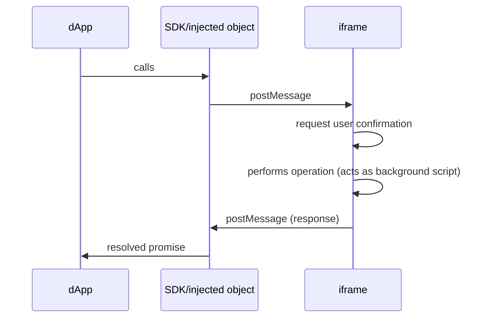

# Wander Embedded

## Message Passing

<table>
  <tr>
    <th>BE</th>
    <th>Embed</th>
  </tr>

  <tr>
    <td>

BE injects the Wallet API with the `setupWalletSDK` function, invoked from
`src/contents/injected/setup-wallet-sdk.injected-script.ts`, which is injected using a `script` tag by
`src/contents/api.ts`.

This is done this way because `src/contents/api.ts` is a sandboxed extension content script, so it can use
`sendMessage(...)` to talk to the background script, but cannot directly modify the integrating dApp `window` to add the
wallet API. The injected script can add the wallet API to `window`, but cannot use `sendMessage(...)`, so
`setupWalletSDK` will post messages that are received in `api.ts`'s `message` listener, which then re-sends them to the
background script using `sendMessage(...)`.

</td>
<td>

Embed injects the Wallet API with the `setupEmbeddedWalletSDK` function, invoked from `WanderEmbedded`'s `constructor`.

It runs in the context of the integrating dApp.

</td>

  </tr>

  <tr>
    <td>

When a wallet API method is called from the integrating dApp, the inner `callForegroundThenBackground` function inside
`setupWalletSDK` is called.

This functions posts a message that will be received in `api.ts`'s `message` listener, which then re-sends them to the
background script using `sendMessage(...)`, as stated above.

This function also sets a `message` listener to receive the response, which again, is received in `api.ts`'s `message`
listener and re-posted using `postMessage(...)`.

</td>
<td>
When a wallet API method is called from the integrating dApp, the inner `callForegroundThenBackground` function inside `setupEmbeddedWalletSDK` is called.

This function sends the message to the "background" script using `isomorphicSendMessage`, which returns the response as
well.

</td>

  </tr>

  <tr>
    <td>
    </td>
    <td>
    </td>
  </tr>

  <tr>
    <td>
    </td>
    <td>
    </td>
  </tr>
</table>

> [!WARNING] > `setupWalletSDK` and `setupEmbeddedWalletSDK` should eventually be combined into a single function and
> `setupWalletSDK` should also use `isomorphicSendMessage`. Its usage of `postMessage(...)` and the `message` "proxy"
> implemented in `api.ts` should be an implementation detail abstracted away by `isomorphicSendMessage`.

The following diagram illustrates the flow in Embed:

This diagram represents the interaction between the dApp, SDK and the iframe.

## Testing

Scenarios to test:

**New account & wallet:**

After signing up, a new account is created. Verify:

- A new wallet is generated and split with SSS.
- The wallet seedphrase is persisted encrypted in `localStorage` to allow future wallet exports as seedphrase (in this
  same device only).
- A `deviceNonce` is generated and persisted in `localStorage`.
- Its `authShare` is stored in the server, linked to that specific `deviceNonce`.
- Its `deviceShare` is persisted in `localStorage`.

**Wallet backup:**

After signing up/in, backup a wallet using the wallet recovery option, twice on the same wallet. Verify:

- The wallet we are backing is split with SSS.
- Its `recoveryAuthShare` is stored in the server.
- Its `recoveryBackupShare` is downloaded in a JSON file.
- The JSON file includes a signature from the server, that allows it to verify this file was once filed even after the
  recovery share is deleted from the DB.
- The `recoveryBackupShare` is persisted encrypted in `localStorage` to avoid re-creating new recovery shares if the
  user wants to download it again on that same device.
- Downloading the same wallet recovery option doesn't register a new recovery share on the backend, as stated above.

**Wallet activation:**

After signing in or reloading a session on an existing account a wallet should be activated:

- Initially (v0.1), the last recently used wallet with a matching `deviceShare` available will be automatically
  activated upon successful authentication.

- Later (v1.0), no wallet will be activated until the user/dApp tries to use it. At that point, it will be activated.
  After some time (TBD), it will be deactivated (removed from memory, even encrypted).

Then, verify:

- The `deviceSharePublicKey` is generated using the `deviceShare`.
- A wallet activation challenge is requested from the backend, providing the target `walletId`.
- An `authShare` is fetched after solving the server activation challenge and providing it with the `deviceNonce`.
- The wallet private key is reconstructed and stored encrypted in memory, with a randomly generated password that is
  rotated regularly (until the wallet is deactivated in v1.0)

Note: The backend should also verify when requesting or resolving activation challenges that the `deviceNonce` matches
the stored device data (ip, country, userAgent...).

**Wallet recovery (`deviceNonce` gone):**

On an active session or previously used device, remove the `deviceNonce` from `localStorage`. Then verify:

- The app detects the `deviceNonce` is gone and re-generates it.
- Trying to activate a wallet will fail as the newly generated `deviceNonce` is not linked to any of the existing shares
  stored in the DB.
- The wallet recovery flow is presented to users.
- The `recoveryBackupSharePublicKey` is generated using the `recoveryBackupShare` the user provided using a wallet
  recovery file.
- A wallet recovery challenge is requested form the backend, providing the target `walletId`. As this is the first
  action performed using the newly generated `deviceNonce`, the new device will be registered on the backend.
- A `recoveryAuthShare` is fetched after solving the server wallet recovery challenge and providing it with the new
  `deviceNonce`, which was just registered.
- The wallet private key is reconstructed and stored encrypted in memory, with a randomly generated password that is
  rotated regularly (until the wallet is deactivated in v1.0). Also, the private key is split again using SSS and the
  new work shares are stored in `localStorage` and the server (as per the _New account & wallet_ flow).

**Wallet recovery (`deviceShare` gone):**

On an active session or previously used device, remove the `deviceShare` from `localStorage`. Then verify:

- The app detects the `deviceShare` is gone and the recovery flow is presented to users.
- The `recoveryBackupSharePublicKey` is generated using the `recoveryBackupShare` the user provided using a wallet
  recovery file.
- A wallet recovery challenge is requested form the backend, providing the target `walletId` and the `deviceNonce`.
- A `recoveryAuthShare` is fetched after solving the server wallet recovery challenge.
- The wallet private key is reconstructed and stored encrypted in memory, with a randomly generated password that is
  rotated regularly (until the wallet is deactivated in v1.0). Also, the private key is split again using SSS and the
  new work shares are stored in `localStorage` and the server (as per the _New account & wallet_ flow).

**Account recovery:**

Click on the account recovery option, import a wallet seedphrase or private key linked to an account. Then verify:

- An account recovery list challenge is requested, sending the `walletAddress`.
- A list of wallets linked to that wallet is received upon successful resolution of the challenge.
- After selecting one account (if more than one are linked to the same wallet), an account recovery challenge is
  requested, sending the `accountId`.
- A new authentication method can be linked to the account after solving the server account recovery challenge.

**Missing test scenarios:**

- Reached out work shares limit.
- Reached out recovery shares limit.
- Link auth methods to existing accounts.
- Different errors when the different params mentioned in all the above are incorrect.
