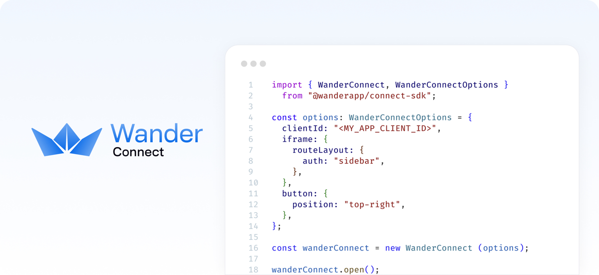

# Wander Connect SDK

Introducing the Wander Connect Embedded Wallet for Arweave and AO.



[](https://www.npmjs.com/package/@wanderapp/connect)
[](https://opensource.org/licenses/MIT)

A simplified, lightweight, customizable embedded wallet for Arweave and AO that bridges the gap between web2 and web3,
helping non-crypto native users onboard into web3 easily!

- 🪪 **Familiar Authentication:** Users sign up/in with their favorite and familiar authentication method: email and
  password, passkeys and social providers (Facebook, Twitter/X, Apple).
- 🔑 **No Seed Phrases:** 5 clicks is all it takes for your users to get to their fully functional wallet. Managing seed
  phrases and backups is an optional step that can be taken care of later.
- 📱 **Simplified UI:** De-clutter UI with all the functionality your users need, but the same functionality as the
  mighty Wander Browser Extension.
- ✨ **Refined Experience:** Light and dark themes, and responsive out-of-the-box. A wallet that works on any device and
  platform, with no download needed.

And offering a great developer experience too:

- 🔌 **Easy Integration**: Easy to use SDK to embed Wander Connect wallet in your dApp.
- 🎨 **Customizable UI**: Extensive customization and layout options. A white-label wallet that can match your brand &
  site/app's look and feel.
- 🔒 **Secure**: User keys are secured using advanced cryptography, such as AES and Shamir Secret Sharing. Neither we
  nor your app will ever get access to users' private keys.

<br />

## Installation

Use the Wander Connect SDK to integrate the Wander Connect embedded wallet in your web applications and dApps.

```bash
npm install @wanderapp/connect
yarn add @wanderapp/connect
pnpm add @wanderapp/connect
bun add @wanderapp/connect
```

<br />

## Basic Usage

To use the Wander Connect embedded wallet, you first need to instante it:

```javascript
import { WanderConnect } from "@wanderapp/connect";

// Initialize Wander Connect:
const wander = new WanderConnect({ clientId: "FREE_TRIAL" });
```

<br />

## Docs

If you want to learn how to integrate Wander Connect into your project, please take a look at our officials docs:

https://docs.wander.app/wander-connect/intro

If you want to learn how to run and build your own Wander Connect SDK to hopefully contribute to our project, you can
find that information in [`DEVELOPMENT.md`](./DEVELOPMENT.md).
